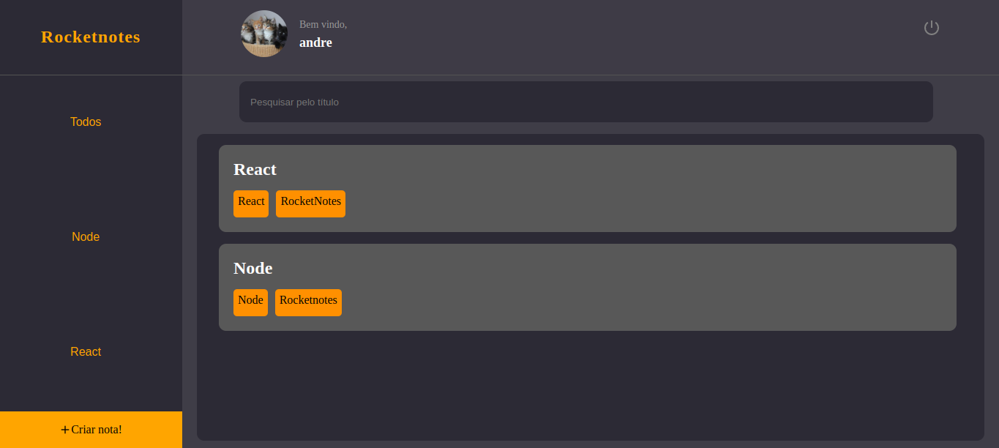

<h1> ROCKET NOTES </h1>

ROCKET NOTES is a fullstack project being a notepad, the project consists of frontend (ReactJs) and backend (NodeJs).

<h1>🎨 Screenshots</h1>

<h1>🚀 Technologies</h1>

This project was developed with the following technologies:

- [Typescript](https://www.typescriptlang.org/)
- [Node.js](https://nodejs.org/en/) | [Express](https://expressjs.com/pt-br/)
- [ReactJs](https://reactjs.org/)
- [MongoDB](https://www.mongodb.com/) | [Mongoose]()

<h1>How to run the project</h1>

**⚙️ Access the project's Backend folder:**

    cd backend

**Then run:**

    yarn dev

**🖥️ Access the project's Frontend folder:**

    cd frontend

**Then run:**

    yarn start